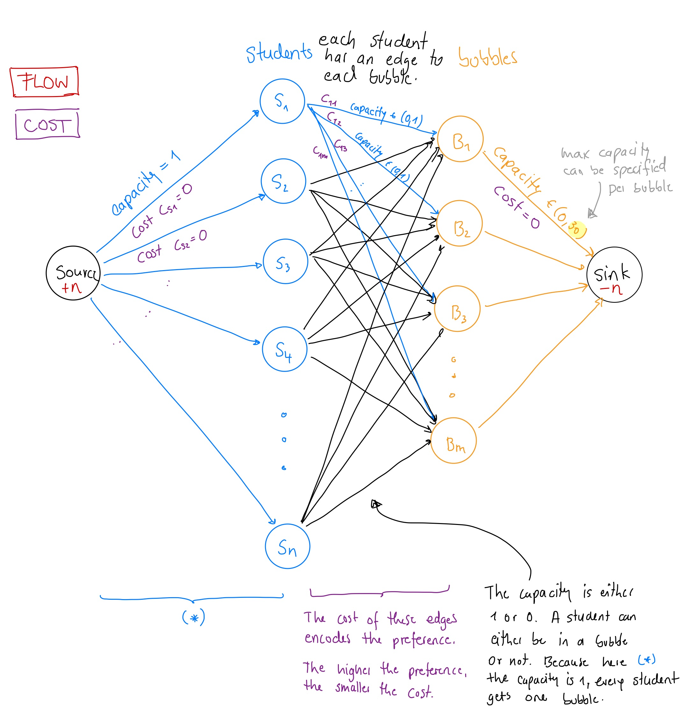

# Studentbubbles 

The repository contains the code for solving two different student arrangement problems used at the 
Uebungsgrupppenverwaltung of the Physikalische Fakultaet, Uni Heidelberg.

*Author: Konstantin Neureither, dev@kneureither.de*

The arrangement optimizations that can be solved are:

* Division of students into bubbles, respecting their individual preferences. (called by a script)
* Divisions of students into professor meetings, also using student preferences. (stand-alone using json input data)

Both algorithms are based on a min-cost-flow graph implementation and use the *ortools* frame work provided by Google.


## Student Bubble Optimization

The optimization can be found in ```bubble_optimization.py```.
The function ```solve_bubble_optimization(preferences, bubble_capacities, preference_costs)``` can just be imported into 
the webinterface or in another program.

```bubble_examples.py``` and ```bubble_benchmark.py``` contain some examples as well as a test comparing different preference cost vectors.

The graph that is modelled can be described like:




## Meet-Your-Prof Optimization

The Meet-Your Prof optimization code can be found in *meetyourprof.py* as well as in *classes/professordate.py*. The former
implements the json data read of professors and the preferences and uses the function of the student bubble optimisation 
to solve a graph problem that looks similar as the former one. 

In a second step, the memeber count of the dates is optimised, as we only want to allow dates that contain six students. 
Therefore, the ```Professor``` class is needed. It handles the students that were assigned to one professor and can be used
to swap students aroudn between different professors. The algorithm tries to fill up as many dates as possible, by putting
the dates that are not full into a queue (sorted by number of students). From that, always the first and last are extracted and the students from the last 
added to the students to the first. 

This is continued until the queue is only contains one or no item. 

The algorithm has one problem, namely that it is by chance possible, that a student is added twice to the same prof, which
leads to one student having one date less or two dates with the same prof. At this is an edge case (having in mind, that
there are 40 profs and more than 100 students) this behaviour is accepted.

